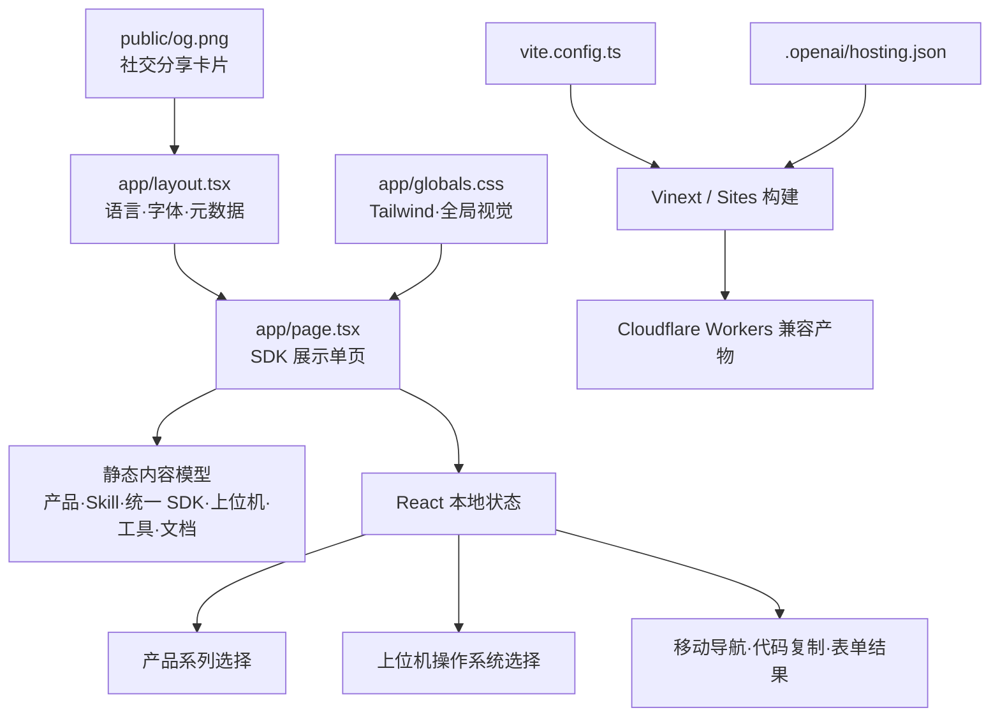

# 架构文档

> 本文档由 Codex 自动生成和维护。最后更新于：2026-09-09

## 1. 项目概述

Shroom Developer 是一个面向传感器与硬件开发者的单页 SDK 展示站。页面按照“选择产品 → 使用 Shroom Skill 快速接入 → 获取统一 SDK → 下载 Shroom 上位机 → 使用工具 → 阅读文档”的路径组织内容。

**当前版本的下载与文档都是真实可用的，不再是骨架**：

- **统一 SDK** —— `public/shroom-sdk.zip` 由 `npm run build` 从 `sdk/` 现打，不按操作系统分包。
- **Windows 上位机** —— 真实安装包，版本 / 体积 / SHA-256 来自 `app/desktop-release.json`，
  由 `scripts/sync-desktop-release.mjs` 从安装包本身算出。macOS / Linux 尚未打包，页面上是灰态「即将发布」。
- **文档中心** —— `/docs` 与 `/docs/:slug` 在构建期由 `scripts/build-docs.mjs` 把 `sdk/*.md`
  预渲染成 HTML，运行时不读磁盘。
- **网页测试台** —— `public/lab.html`，浏览器直连串口看数据。
- **手套体验站** —— 外链到独立部署的 <https://glove.jq-industries.io/>。
- **获取登记** —— 下载前弹窗收集姓名/手机，POST 到密钥系统的 `/sdk-requests`；
  **登记失败不挡下载**，这不是审批流程。

仍为占位的只有两处：「点位映射生成器」与「工程验证工具（含力学标定）」，页面上明确标注为灰态「规划中」。

页面 **不提供、也不会提供** kPa / 牛顿等物理单位换算 —— SDK 给到的是 0~1 相对值，
标定曲线逐台设备不同，不在公开 SDK 范围内。`#capabilities` 里有一块「SDK 里没有这些」把边界写死。

## 2. 技术栈

| 分类 | 技术 | 版本/说明 |
| :--- | :--- | :--- |
| **前端框架** | React / Next.js App Router | React 19.2.6、Next.js 16.2.6 |
| **构建与运行** | Vinext / Vite | Vinext 1.0.0-beta.3、Vite 8.0.13 |
| **样式系统** | Tailwind CSS | Tailwind CSS 4.2.1，配合少量全局 CSS |
| **后端框架** | 无 | 当前为纯前端展示站 |
| **数据库** | 无 | `.openai/hosting.json` 未启用 D1 / R2 |
| **编程语言** | TypeScript / TSX / CSS | TypeScript 5.9.3，严格模式 |
| **包管理器** | npm | 使用 `package-lock.json` 固定依赖 |
| **部署环境** | OpenAI Sites / Cloudflare Workers | 通过 `@openai/sites-vite-plugin` 与 Cloudflare Vite 插件构建，已配置生产站点基址 |
| **其他关键库** | next/font | Geist 与 Geist Mono 字体 |

## 3. 目录结构

```text
shroomSDKWEB/
├─ .openai/
│  └─ hosting.json          # Sites 项目及逻辑资源绑定
├─ app/
│  ├─ globals.css           # Tailwind 入口、全局基础样式与背景纹理
│  ├─ layout.tsx            # 页面语言、字体与站点分享元数据
│  ├─ page.tsx              # 单页内容、数据模型与前端交互
│  ├─ desktop-release.json  # 上位机版本/体积/SHA-256，由脚本生成，禁止手改
│  └─ docs/                 # 文档中心路由（内容构建期生成）
├─ scripts/
│  ├─ build-sdk-bundle.mjs  # 生成 sdk/web/shroom.bundle.js 单文件版
│  ├─ pack-sdk.mjs          # sdk/ → public/shroom-sdk.zip（保留 start.sh 可执行位）
│  ├─ build-docs.mjs        # sdk/*.md → 预渲染 HTML，供 /docs 使用
│  └─ sync-desktop-release.mjs  # 安装包 → public/downloads/ + desktop-release.json
├─ sdk/                     # SDK 源码与文档的事实源，打包进 zip 并生成文档站
├─ public/
│  ├─ favicon.svg           # 站点图标
│  ├─ og.png                # 1200×630 社交分享卡片
│  ├─ lab.html              # 网页测试台（Web Serial 直连设备）
│  ├─ shroom-sdk.zip        # 构建产物
│  └─ downloads/            # 上位机安装包，已 gitignore，生产走 Nginx alias
├─ todo/
│  └─ SDK_SKILL_TODO.md     # SDK、手套接入、Skill 与展示站的分阶段待办
├─ ARCHITECTURE.md          # 本架构说明
├─ DEPLOY.md                # 部署、上位机发版流程与 Nginx 配置
├─ eslint.config.mjs        # ESLint 配置
├─ next.config.ts           # Next.js 配置
├─ package.json             # 脚本与依赖
├─ package-lock.json        # npm 锁文件
├─ tsconfig.json            # TypeScript 配置
└─ vite.config.ts           # Vinext、Sites、Tailwind 与 Worker 构建配置
```

### 关键目录说明

| 目录 | 主要功能 |
| :--- | :--- |
| `/app` | App Router 页面、根布局、站点级样式与上位机发布元数据 |
| `/scripts` | 构建期脚本：打 SDK zip、预渲染文档、同步上位机安装包 |
| `/sdk` | SDK 源码与 `AI-CONTEXT.md` 等文档的**唯一事实源**，zip 和文档站都从这里生成 |
| `/public` | 静态资源、网页测试台、SDK zip 与上位机安装包 |
| `/.openai` | OpenAI Sites 部署项目标识与逻辑资源声明 |
| `/todo` | 记录 SDK 事实源、手套接入闭环、Shroom Skill 和展示站真实业务接入的待办与验收标准 |

## 4. 核心模块与数据流

### 4.1 模块关系图



### 4.2 主要数据流

1. **产品资源定位**
   - 用户选择产品系列。
   - `activeProduct` 在本地更新，`useMemo` 得到当前产品信息。
   - 页面展示对应的规格书、SDK、网页测试或 Mapping 资源入口。
2. **Shroom Skill 推荐接入**
   - 页面突出展示 Skill 所包含的设备协议、统一 SDK 接口、Mapping 规则和示例上下文。
   - 用户按“安装 Skill → 描述设备与目标 → 生成并验证接入”的三步路径开始开发。
3. **统一 SDK 与上位机资源**
   - 统一 SDK 作为单一资源呈现，不按 Windows、macOS、Linux 分包。
   - `activePlatform` 驱动上位机卡片：Windows 显示真实版本、体积、更新日志、SHA-256 与下载按钮；
     macOS / Linux 为 `status: 'planned'`，渲染成不可点的「即将发布」，**不挂假文件名**。
4. **手动接入与代码复制**
   - 示例代码以静态内容呈现。
   - 复制按钮通过 Clipboard API 写入剪贴板并显示短暂反馈；SHA-256 复用同一套复制反馈。
5. **下载登记**
   - SDK 与 Windows 上位机共用一个弹窗（`gateTarget` 记住是谁触发的），
     标题、副标题、登记来源 `source` 随触发方切换。
   - 提交后 POST 到密钥系统的 `/sdk-requests`，**无论成功失败都立即开始下载**并写
     `localStorage`，下次不再弹。

## 5. API 端点

站点自身没有 API 路由（`next.config.ts` 为空配置，页面是 `'use client'` 单文件）。
唯一的外部写入是浏览器直接跨域 POST 到密钥系统：

| 方法 | 地址 | 用途 |
| :--- | :--- | :--- |
| `POST` | `${NEXT_PUBLIC_SDK_REGISTRY_URL}`（默认 `https://shroom.jq-industries.com/sdk-requests`） | 提交下载登记线索，由密钥系统的 CORS 接口接住 |

该接口不参与鉴权，也不阻塞下载。

## 6. 外部依赖与集成

| 服务/库 | 用途 | 集成方式 |
| :--- | :--- | :--- |
| OpenAI Sites | 站点版本管理与托管 | `@openai/sites-vite-plugin` + `.openai/hosting.json` |
| Cloudflare Workers | 托管运行时与本地模拟 | `@cloudflare/vite-plugin` |
| Tailwind CSS | 响应式布局与组件样式 | PostCSS 插件 |
| Clipboard API | 复制快速开始示例 | 浏览器端调用 |

当前没有外部业务 API、数据库、用户认证或第三方连接器。

## 7. 环境变量

应用运行时不要求环境变量，全部有默认值。下面两个是**构建期注入**的（`NEXT_PUBLIC_` 前缀），
改完必须重新 `npm run build` 才生效，详见 [DEPLOY.md](DEPLOY.md)：

| 变量名 | 描述 | 默认行为 |
| :--- | :--- | :--- |
| `NEXT_PUBLIC_DESKTOP_DOWNLOAD_BASE` | 上位机安装包所在目录 | `/downloads`，指向 Nginx alias 或 CDN |
| `NEXT_PUBLIC_SDK_REGISTRY_URL` | 下载登记提交地址 | `https://shroom.jq-industries.com/sdk-requests` |

构建工具会使用以下非业务变量：

| 变量名 | 描述 | 默认行为 |
| :--- | :--- | :--- |
| `CODEX_SANDBOX` | 在 Codex macOS 沙箱中切换轮询式 HMR | 非 `seatbelt` 时使用常规文件监听 |
| `WRANGLER_WRITE_LOGS` | Wrangler 日志开关 | `false` |
| `WRANGLER_LOG_PATH` | Wrangler 日志目录 | `.wrangler/logs` |
| `MINIFLARE_REGISTRY_PATH` | Miniflare 注册表目录 | `.wrangler/registry` |

## 8. 项目进度

> 记录项目从开始到现在已经完成的所有工作，每次新增追加到末尾。

| 完成日期 | 完成的功能/工作 | 说明 |
| :--- | :--- | :--- |
| 2026-08-25 | SDK 展示页信息架构 | 将原始思维导图重排为产品选择、能力、下载、流程、工具、文档和试用路径 |
| 2026-08-25 | 响应式单页界面 | 完成桌面端与移动端布局、导航和视觉系统 |
| 2026-08-25 | 产品与平台选择 | 支持产品系列和 Windows、macOS、Linux、浏览器 SDK 的本地切换 |
| 2026-08-25 | 开发资源展示 | 加入代码示例、网页测试台、Mapping、AI Skill 与工程验证工具入口 |
| 2026-08-25 | 试用申请演示 | 加入姓名、手机号、邮箱、机构字段与前端提交反馈 |
| 2026-08-25 | 站点分享元数据 | 配置中文标题、描述和 1200×630 品牌分享图 |
| 2026-08-25 | 生产站点发布 | 配置规范链接、生产基址与可解析为绝对地址的分享卡片元数据 |
| 2026-08-25 | Skill 优先接入与资源重构 | 将 Shroom Skill 提升为推荐入口，并拆分统一 SDK 与分平台上位机下载 |
| 2026-08-26 | SDK 与 Skill 实施清单 | 基于手套接入样例整理 SDK 契约、设备描述、Mapping、真实数据、Skill、展示站和发布工作的分阶段 TODO |
| 2026-09-09 | 清理假入口 | 未实现的资源入口改为真实去处或标注「规划中」，不再把「规格书」「Mapping JSON」指到空页面 |
| 2026-09-09 | 网页测试台上线 | `public/lab.html`，Web Serial 直连设备看数据 |
| 2026-09-09 | 文档中心上线 | `scripts/build-docs.mjs` 构建期预渲染 `sdk/*.md`，提供 `/docs` 与 `/docs/:slug` |
| 2026-09-09 | 跨平台说明补全 | README / AI-CONTEXT / 怎么用AI开发 三份文档补齐三系统的启动方式与驱动权限差异 |
| 2026-09-09 | Windows 上位机发布 | 打出 1.1.34 安装包并接入站点，展示版本、体积、更新日志与 SHA-256；macOS / Linux 保持「即将发布」 |
| 2026-09-09 | 下载登记通用化 | SDK 与上位机共用一个登记弹窗，来源区分开，登记失败不阻塞下载 |
| 2026-09-09 | 能力边界显式化 | 首页新增「SDK 里没有这些」，与 SDK 文档中的能力边界表一致，明确不提供 kPa 换算 |
| 2026-09-09 | 产品搜索与手套体验站 | 产品系列搜索框接上真实过滤；接入外部手套体验站 <https://glove.jq-industries.io/> |
| 2026-09-09 | 部署文档 | 新增 `DEPLOY.md`，覆盖上位机打包、同步脚本、Nginx alias 与发版流程 |

## 9. 更新日志

| 日期 | 变更类型 | 描述 |
| :--- | :--- | :--- |
| 2026-08-25 | 初始化 | 创建项目架构文档 |
| 2026-08-25 | 新增功能 | 完成 Shroom SDK 展示页首版结构与前端交互 |
| 2026-08-25 | 配置变更 | 绑定 OpenAI Sites 项目并补充生产站点元数据基址 |
| 2026-08-25 | 优化重构 | 强化 Shroom Skill 快速接入说明，明确 SDK 不区分平台、上位机按系统提供 |
| 2026-08-26 | 文档更新 | 新增 SDK、手套接入与 Shroom Skill 分阶段 TODO，并补充对应目录说明 |
| 2026-09-09 | 新增功能 | 网页测试台、文档中心、Windows 上位机下载与通用下载登记弹窗上线 |
| 2026-09-09 | 优化重构 | 能力卡片按 SDK 实际能力重写，补「SDK 里没有这些」边界说明，产品资源入口全部指向真实去处 |
| 2026-09-09 | 文档更新 | 新增 DEPLOY.md；更新本文档第 1、3、4、5、7 节，去掉「前端骨架」「试用申请演示」等过期描述 |

---

*此文档旨在提供项目架构快照，具体实现细节请参考源代码。*
