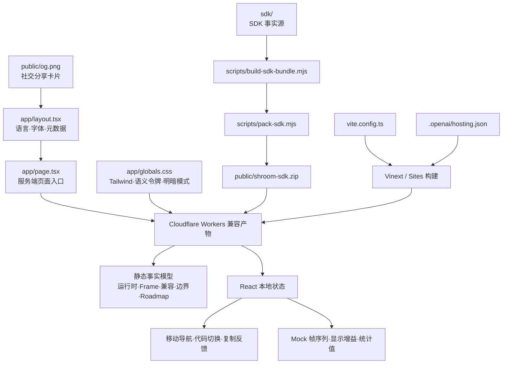

# 架构文档

> 本文档由 Codex 自动生成和维护。最后更新于：2026-08-28

## 1. 项目概述

Shroom Developer 是一个面向传感器与硬件开发者的 SDK 产品页。页面围绕当前可下载的 `shroom-sdk@0.1.0` 组织内容，核心链路为“选择数据源 → 获得 Device → 订阅统一 Frame → 渲染热力图或进入业务逻辑”。首屏直接展示最短 Mock 代码和压力帧结果，随后提供 Mock、浏览器 Web Serial、Node / Electron 三条接入路径。

当前版本已经提供可交互的 Mock Grid、显示增益、运行环境代码切换、代码复制、SDK ZIP 下载、Frame 合同、兼容性与能力边界说明。环境无关的是 Core 与 Frame 数据合同；浏览器和 Node 分别使用 Web Serial 与 serialport 适配器。Mapping、安装式 Shroom Skill、AI 文档问答、产品 Profile、分平台上位机、采集回放和 CSV 被明确列为规划能力，不再作为已交付功能展示。

## 2. 技术栈

| 分类 | 技术 | 版本/说明 |
| :--- | :--- | :--- |
| **前端框架** | React / Next.js App Router | React 19.2.6、Next.js 16.2.6 |
| **构建与运行** | Vinext / Vite | Vinext 1.0.0-beta.3、Vite 8.0.13 |
| **样式系统** | Tailwind CSS | Tailwind CSS 4.2.1，配合少量全局 CSS |
| **后端框架** | 无 | 当前为纯前端展示站 |
| **数据库** | 无 | `.openai/hosting.json` 未启用 D1 / R2 |
| **编程语言** | TypeScript / TSX / CSS | TypeScript 5.9.3，严格模式 |
| **包管理器** | npm | 使用 `package-lock.json` 固定依赖 |
| **部署环境** | OpenAI Sites / Cloudflare Workers | 通过 `@openai/sites-vite-plugin` 与 Cloudflare Vite 插件构建，已配置生产站点基址 |
| **其他关键库** | next/font | Geist 与 Geist Mono 字体 |

## 3. 目录结构

```text
C:\sdk
├─ .openai/
│  └─ hosting.json          # Sites 项目及逻辑资源绑定
├─ app/
│  ├─ globals.css           # Tailwind 入口、语义视觉令牌、明暗模式与全局基础样式
│  ├─ layout.tsx            # 页面语言、字体与 SDK 产品分享元数据
│  ├─ page.tsx              # App Router 服务端页面入口
│  └─ sdk-page.tsx          # SDK 产品内容与 Mock、代码切换、复制等客户端交互
├─ sdk/
│  ├─ core/                 # Frame 解码、切帧、Mock 与颜色映射
│  ├─ web/                  # Web Serial、Canvas 热力图与浏览器示例
│  ├─ node/                 # serialport 适配器、端口枚举与终端渲染
│  ├─ index.d.ts            # 当前公共类型声明
│  └─ README.md             # SDK 使用说明与排障
├─ scripts/
│  ├─ build-sdk-bundle.mjs  # 生成浏览器经典脚本 bundle
│  └─ pack-sdk.mjs          # 将 sdk/ 打包为公开下载 ZIP
├─ public/
│  ├─ favicon.svg           # 站点图标
│  ├─ og.png                # 1200×630 社交分享卡片
│  └─ shroom-sdk.zip        # 构建时从 sdk/ 自动生成的下载包
├─ todo/
│  └─ SDK_SKILL_TODO.md     # SDK、手套接入、Skill 与展示站的分阶段待办
├─ ARCHITECTURE.md          # 本架构说明
├─ eslint.config.mjs        # ESLint 配置
├─ next.config.ts           # Next.js 配置
├─ package.json             # 脚本与依赖
├─ package-lock.json        # npm 锁文件
├─ tsconfig.json            # TypeScript 配置
└─ vite.config.ts           # Vinext、Sites、Tailwind 与 Worker 构建配置
```

### 关键目录说明

| 目录 | 主要功能 |
| :--- | :--- |
| `/app` | App Router 页面、SDK 客户端交互、根布局和站点级样式 |
| `/sdk` | 当前展示页与下载物的 SDK 事实源 |
| `/scripts` | 构建浏览器 bundle 并生成下载 ZIP |
| `/public` | Favicon、Open Graph 分享图和可下载 SDK 包 |
| `/.openai` | OpenAI Sites 部署项目标识与逻辑资源声明 |
| `/todo` | 记录 SDK 事实源、手套接入闭环、Shroom Skill 和展示站真实业务接入的待办与验收标准 |

## 4. 核心模块与数据流

### 4.1 模块关系图



### 4.2 主要数据流

1. **SDK 首次成功路径**
   - 用户下载并解压 ZIP，运行 `node start.mjs`。
   - 没有硬件时使用 `Shroom.mock()`，真实浏览器设备使用 Web Serial，Node / Electron 使用 serialport。
   - 所有数据源最终进入 `Device.onFrame()` 并返回统一 Frame。
2. **交互式 Mock 体验**
   - `createPressureFrame()` 生成确定性的二维模拟压力值。
   - 本地状态控制开始、暂停、逐帧和显示增益。
   - `calculateStats()` 从当前帧计算 max、area 与 center，页面明确标识为 Mock Grid，不冒充真实设备遥测。
3. **运行环境代码切换**
   - `activeSample` 在 Mock、浏览器与 Node 示例之间切换。
   - 浏览器示例保证 `connect()` 位于用户点击回调内，Node 示例包含串口依赖与资源关闭。
   - Clipboard API 复制启动命令或当前代码，并提供短暂反馈。
4. **SDK 下载与发布**
   - `sdk/` 是页面能力说明和 ZIP 内容的事实源。
   - `npm run build` 先生成经典浏览器 bundle，再由打包脚本刷新 `public/shroom-sdk.zip`。
   - 页面公开版本、运行时、技术预览状态和授权条款待补充提示。
5. **规划能力分流**
   - Skill、AI 问答、Mapping、产品 Profile、上位机与采集工具统一进入 Roadmap。
   - 尚未交付的入口不再使用可下载或已完成状态。

## 5. API 端点

当前项目没有 API 路由。后续接入下载鉴权、产品目录或试用申请时，建议新增服务端端点并将前端演示状态替换为真实请求。

## 6. 外部依赖与集成

| 服务/库 | 用途 | 集成方式 |
| :--- | :--- | :--- |
| OpenAI Sites | 站点版本管理与托管 | `@openai/sites-vite-plugin` + `.openai/hosting.json` |
| Cloudflare Workers | 托管运行时与本地模拟 | `@cloudflare/vite-plugin` |
| Tailwind CSS | 响应式布局与组件样式 | PostCSS 插件 |
| Clipboard API | 复制启动命令与接入示例 | 浏览器端调用 |
| MatchMedia API | 遵循系统减少动态效果偏好 | 浏览器端调用 |

当前没有外部业务 API、数据库、用户认证或第三方连接器。展示站不会直接连接真实串口；真实 Web Serial 通过下载包中的本地 Demo 运行。

## 7. 环境变量

应用运行时不要求业务环境变量。页面中的串口路径、波特率和示例数据只用于说明 SDK 接入方式，不会被站点读取或上传。

构建工具会使用以下非业务变量：

| 变量名 | 描述 | 默认行为 |
| :--- | :--- | :--- |
| `CODEX_SANDBOX` | 在 Codex macOS 沙箱中切换轮询式 HMR | 非 `seatbelt` 时使用常规文件监听 |
| `WRANGLER_WRITE_LOGS` | Wrangler 日志开关 | `false` |
| `WRANGLER_LOG_PATH` | Wrangler 日志目录 | `.wrangler/logs` |
| `MINIFLARE_REGISTRY_PATH` | Miniflare 注册表目录 | `.wrangler/registry` |

## 8. 项目进度

> 记录项目从开始到现在已经完成的所有工作，每次新增追加到末尾。

| 完成日期 | 完成的功能/工作 | 说明 |
| :--- | :--- | :--- |
| 2026-08-25 | SDK 展示页信息架构 | 将原始思维导图重排为产品选择、能力、下载、流程、工具、文档和试用路径 |
| 2026-08-25 | 响应式单页界面 | 完成桌面端与移动端布局、导航和视觉系统 |
| 2026-08-25 | 产品与平台选择 | 支持产品系列和 Windows、macOS、Linux、浏览器 SDK 的本地切换 |
| 2026-08-25 | 开发资源展示 | 加入代码示例、网页测试台、Mapping、AI Skill 与工程验证工具入口 |
| 2026-08-25 | 试用申请演示 | 加入姓名、手机号、邮箱、机构字段与前端提交反馈 |
| 2026-08-25 | 站点分享元数据 | 配置中文标题、描述和 1200×630 品牌分享图 |
| 2026-08-25 | 生产站点发布 | 配置规范链接、生产基址与可解析为绝对地址的分享卡片元数据 |
| 2026-08-25 | Skill 优先接入与资源重构 | 将 Shroom Skill 提升为推荐入口，并拆分统一 SDK 与分平台上位机下载 |
| 2026-08-26 | SDK 与 Skill 实施清单 | 基于手套接入样例整理 SDK 契约、设备描述、Mapping、真实数据、Skill、展示站和发布工作的分阶段 TODO |
| 2026-08-28 | SDK 事实源审计 | 以 `sdk/` 运行时代码、README、类型声明和可执行 Mock 为准核对已交付能力与边界 |
| 2026-08-28 | SDK 产品页重构 | 将首页从综合说明文档改为代码优先、结果优先的 SDK 产品页，并保留既有深链锚点 |
| 2026-08-28 | 交互式 Mock Grid | 加入开始、暂停、逐帧、显示增益和 Frame 统计，明确区分模拟值与真实遥测 |
| 2026-08-28 | 多运行时快速开始 | 提供 Mock、Web Serial、Node / Electron 三套准确示例与复制反馈 |
| 2026-08-28 | 兼容性与边界公开 | 明确 Browser / Node adapter 差异、版本、授权状态、物理单位限制与规划能力 |
| 2026-08-28 | 语义视觉令牌 | 将核心蓝色品牌与中性色集中为语义 CSS 变量，并支持系统明暗模式与减少动态效果偏好 |

## 9. 更新日志

| 日期 | 变更类型 | 描述 |
| :--- | :--- | :--- |
| 2026-08-25 | 初始化 | 创建项目架构文档 |
| 2026-08-25 | 新增功能 | 完成 Shroom SDK 展示页首版结构与前端交互 |
| 2026-08-25 | 配置变更 | 绑定 OpenAI Sites 项目并补充生产站点元数据基址 |
| 2026-08-25 | 优化重构 | 强化 Shroom Skill 快速接入说明，明确 SDK 不区分平台、上位机按系统提供 |
| 2026-08-26 | 文档更新 | 新增 SDK、手套接入与 Shroom Skill 分阶段 TODO，并补充对应目录说明 |
| 2026-08-28 | 优化重构 | 重构 SDK 产品页信息架构、交互体验、元数据与视觉令牌，删除假实时和无效入口 |
| 2026-08-28 | 文档更新 | 同步当前 SDK 事实源、模块关系、Mock 数据流、构建下载链路与 Roadmap 状态 |

---

*此文档旨在提供项目架构快照，具体实现细节请参考源代码。*
