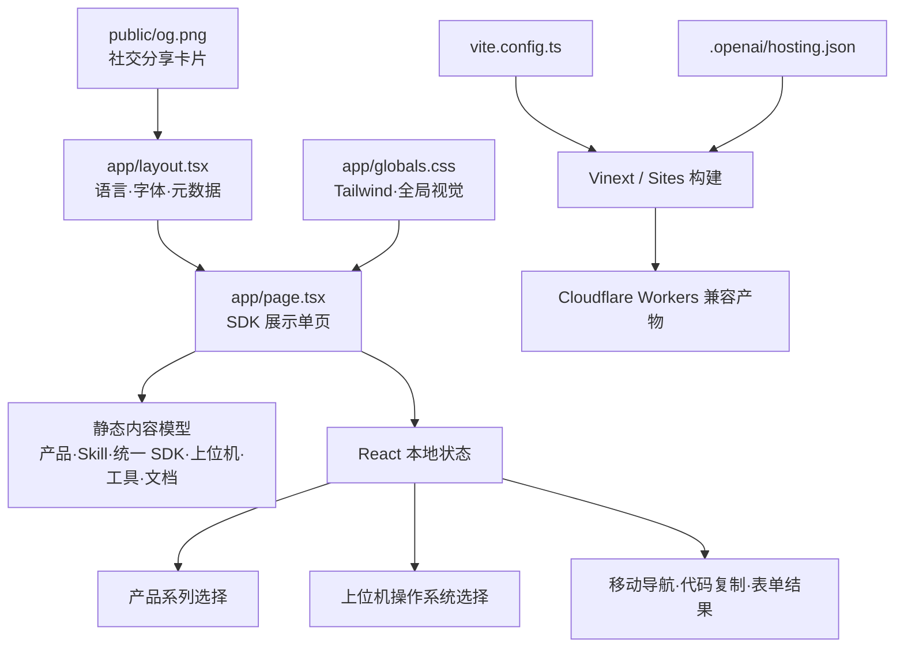

# 架构文档

> 本文档由 Codex 自动生成和维护。最后更新于：2026-08-26

## 1. 项目概述

Shroom Developer 是一个面向传感器与硬件开发者的单页 SDK 展示站。页面按照“选择产品 → 使用 Shroom Skill 快速接入 → 获取统一 SDK → 下载分平台上位机与驱动 → 使用工具 → 阅读文档 → 申请试用”的路径组织内容，集中展示规格书、AI Skill、统一 SDK、网页测试、Mapping 配置、示例工程与 7 天试用入口。

当前版本为可交互的前端页面骨架：SDK 被定义为不按操作系统分包的统一开发能力，Windows、macOS、Linux 选择仅作用于 Shroom 上位机与驱动。产品与上位机平台切换、移动端导航、代码复制和试用表单状态均在浏览器本地完成；真实产品目录、下载文件、串口连接、文档地址和试用申请接口尚待业务系统接入。

## 2. 技术栈

| 分类 | 技术 | 版本/说明 |
| :--- | :--- | :--- |
| **前端框架** | React / Next.js App Router | React 19.2.6、Next.js 16.2.6 |
| **构建与运行** | Vinext / Vite | Vinext 1.0.0-beta.3、Vite 8.0.13 |
| **样式系统** | Tailwind CSS | Tailwind CSS 4.2.1，配合少量全局 CSS |
| **后端框架** | 无 | 当前为纯前端展示站 |
| **数据库** | 无 | `.openai/hosting.json` 未启用 D1 / R2 |
| **编程语言** | TypeScript / TSX / CSS | TypeScript 5.9.3，严格模式 |
| **包管理器** | npm | 使用 `package-lock.json` 固定依赖 |
| **部署环境** | OpenAI Sites / Cloudflare Workers | 通过 `@openai/sites-vite-plugin` 与 Cloudflare Vite 插件构建，已配置生产站点基址 |
| **其他关键库** | next/font | Geist 与 Geist Mono 字体 |

## 3. 目录结构

```text
C:\sdk
├─ .openai/
│  └─ hosting.json          # Sites 项目及逻辑资源绑定
├─ app/
│  ├─ globals.css           # Tailwind 入口、全局基础样式与背景纹理
│  ├─ layout.tsx            # 页面语言、字体与站点分享元数据
│  └─ page.tsx              # 单页内容、数据模型与前端交互
├─ public/
│  ├─ favicon.svg           # 站点图标
│  └─ og.png                # 1200×630 社交分享卡片
├─ todo/
│  └─ SDK_SKILL_TODO.md     # SDK、手套接入、Skill 与展示站的分阶段待办
├─ ARCHITECTURE.md          # 本架构说明
├─ eslint.config.mjs        # ESLint 配置
├─ next.config.ts           # Next.js 配置
├─ package.json             # 脚本与依赖
├─ package-lock.json        # npm 锁文件
├─ tsconfig.json            # TypeScript 配置
└─ vite.config.ts           # Vinext、Sites、Tailwind 与 Worker 构建配置
```

### 关键目录说明

| 目录 | 主要功能 |
| :--- | :--- |
| `/app` | App Router 页面、根布局和站点级样式 |
| `/public` | Favicon、Open Graph 分享图等静态资源 |
| `/.openai` | OpenAI Sites 部署项目标识与逻辑资源声明 |
| `/todo` | 记录 SDK 事实源、手套接入闭环、Shroom Skill 和展示站真实业务接入的待办与验收标准 |

## 4. 核心模块与数据流

### 4.1 模块关系图



### 4.2 主要数据流

1. **产品资源定位**
   - 用户选择产品系列。
   - `activeProduct` 在本地更新，`useMemo` 得到当前产品信息。
   - 页面展示对应的规格书、SDK、网页测试或 Mapping 资源入口。
2. **Shroom Skill 推荐接入**
   - 页面突出展示 Skill 所包含的设备协议、统一 SDK 接口、Mapping 规则和示例上下文。
   - 用户按“安装 Skill → 描述设备与目标 → 生成并验证接入”的三步路径开始开发。
3. **统一 SDK 与上位机资源**
   - 统一 SDK 作为单一资源呈现，不再按 Windows、macOS、Linux 分包。
   - `activePlatform` 仅驱动 Shroom 上位机的兼容环境、驱动资源和安装包名称更新。
4. **手动接入与代码复制**
   - 示例代码以静态内容呈现。
   - 复制按钮通过 Clipboard API 写入剪贴板并显示短暂反馈。
5. **试用申请演示**
   - 浏览器原生校验必填项和邮箱格式。
   - 提交后仅切换本地成功状态；当前不会向外部服务发送数据。

## 5. API 端点

当前项目没有 API 路由。后续接入下载鉴权、产品目录或试用申请时，建议新增服务端端点并将前端演示状态替换为真实请求。

## 6. 外部依赖与集成

| 服务/库 | 用途 | 集成方式 |
| :--- | :--- | :--- |
| OpenAI Sites | 站点版本管理与托管 | `@openai/sites-vite-plugin` + `.openai/hosting.json` |
| Cloudflare Workers | 托管运行时与本地模拟 | `@cloudflare/vite-plugin` |
| Tailwind CSS | 响应式布局与组件样式 | PostCSS 插件 |
| Clipboard API | 复制快速开始示例 | 浏览器端调用 |

当前没有外部业务 API、数据库、用户认证或第三方连接器。

## 7. 环境变量

应用运行时不要求环境变量。`page.tsx` 中出现的 `SHROOM_KEY` 仅是页面展示的 SDK 示例代码，不会被站点读取。

构建工具会使用以下非业务变量：

| 变量名 | 描述 | 默认行为 |
| :--- | :--- | :--- |
| `CODEX_SANDBOX` | 在 Codex macOS 沙箱中切换轮询式 HMR | 非 `seatbelt` 时使用常规文件监听 |
| `WRANGLER_WRITE_LOGS` | Wrangler 日志开关 | `false` |
| `WRANGLER_LOG_PATH` | Wrangler 日志目录 | `.wrangler/logs` |
| `MINIFLARE_REGISTRY_PATH` | Miniflare 注册表目录 | `.wrangler/registry` |

## 8. 项目进度

> 记录项目从开始到现在已经完成的所有工作，每次新增追加到末尾。

| 完成日期 | 完成的功能/工作 | 说明 |
| :--- | :--- | :--- |
| 2026-08-25 | SDK 展示页信息架构 | 将原始思维导图重排为产品选择、能力、下载、流程、工具、文档和试用路径 |
| 2026-08-25 | 响应式单页界面 | 完成桌面端与移动端布局、导航和视觉系统 |
| 2026-08-25 | 产品与平台选择 | 支持产品系列和 Windows、macOS、Linux、浏览器 SDK 的本地切换 |
| 2026-08-25 | 开发资源展示 | 加入代码示例、网页测试台、Mapping、AI Skill 与工程验证工具入口 |
| 2026-08-25 | 试用申请演示 | 加入姓名、手机号、邮箱、机构字段与前端提交反馈 |
| 2026-08-25 | 站点分享元数据 | 配置中文标题、描述和 1200×630 品牌分享图 |
| 2026-08-25 | 生产站点发布 | 配置规范链接、生产基址与可解析为绝对地址的分享卡片元数据 |
| 2026-08-25 | Skill 优先接入与资源重构 | 将 Shroom Skill 提升为推荐入口，并拆分统一 SDK 与分平台上位机下载 |
| 2026-08-26 | SDK 与 Skill 实施清单 | 基于手套接入样例整理 SDK 契约、设备描述、Mapping、真实数据、Skill、展示站和发布工作的分阶段 TODO |

## 9. 更新日志

| 日期 | 变更类型 | 描述 |
| :--- | :--- | :--- |
| 2026-08-25 | 初始化 | 创建项目架构文档 |
| 2026-08-25 | 新增功能 | 完成 Shroom SDK 展示页首版结构与前端交互 |
| 2026-08-25 | 配置变更 | 绑定 OpenAI Sites 项目并补充生产站点元数据基址 |
| 2026-08-25 | 优化重构 | 强化 Shroom Skill 快速接入说明，明确 SDK 不区分平台、上位机按系统提供 |
| 2026-08-26 | 文档更新 | 新增 SDK、手套接入与 Shroom Skill 分阶段 TODO，并补充对应目录说明 |

---

*此文档旨在提供项目架构快照，具体实现细节请参考源代码。*
