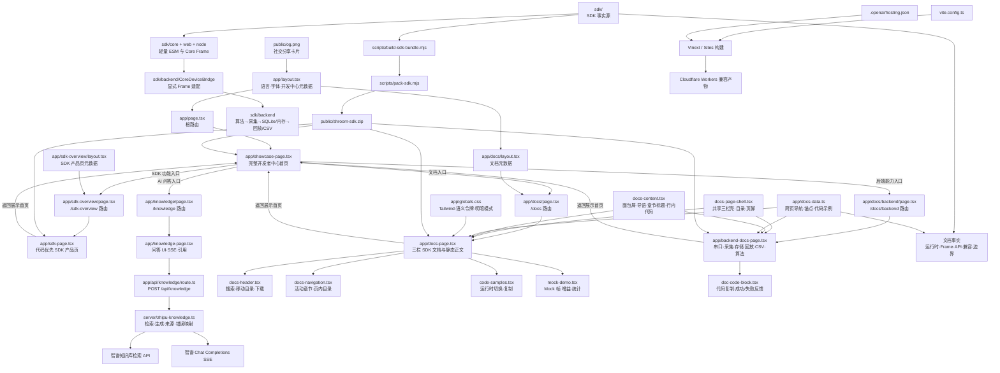

# 架构文档

> 本文档由 Codex 自动生成和维护。最后更新于：2026-08-31

## 1. 项目概述

Shroom Developer 是一个面向传感器与硬件开发者的分层开发中心。根路由 `/` 保留最初的完整展示首页，统一呈现产品选择、SDK Skill 规划、SDK 与分平台上位机、快速开始、Mock 演示、开发工具和文档入口；SDK 产品功能页挂载在 `/sdk-overview`；基础文档挂载在 `/docs`；本地 Node 后端能力作为文档分类挂载在 `/docs/backend`；智谱知识库问答挂载在 `/knowledge`。根目录 `sdk/` 在本地 Vite 开发时会占用 `/sdk` 模块路径，因此产品页面使用 `/sdk-overview`；公开下载仍为 `/shroom-sdk.zip`。轻量链路为“选择数据源 → 获得 Device → 订阅统一 Core Frame → 渲染或进入业务逻辑”，需要长期数据时再经显式适配进入“算法 → 采集 → SQLite / 内存存储 → 回放 / CSV”。知识问答使用“智谱托管知识库混合检索 → 编号化上下文 → GLM 流式生成 → 来源卡片”的两段式 RAG，不在浏览器暴露 API Key。

完整展示首页保留最初的深蓝品牌、产品与平台切换、Skill 主视觉和全部历史锚点，并通过资源卡进入 `/sdk-overview`、`/docs` 与 `/docs/backend`。Skill 展示保留原来的优先级，但明确标记为 Roadmap，避免把尚未创建的安装式 Skill 写成已交付。`/sdk-overview` 提供代码优先的 SDK 产品能力、Mock、Frame 和下载说明；`/docs` 提供基础 API、兼容矩阵和排障；`/docs/backend` 说明串口、采集、存储、回放、CSV 与同步算法通道。环境无关的是 Core 与 Frame 数据合同；浏览器和 Node 分别使用 Web Serial 与 serialport 适配器；`sdk/backend/` 是隔离的 CommonJS、本地 Node-only 边界，不会进入浏览器 bundle 或 Cloudflare Worker。

## 2. 技术栈

| 分类 | 技术 | 版本/说明 |
| :--- | :--- | :--- |
| **前端框架** | React / Next.js App Router | React 19.2.6、Next.js 16.2.6 |
| **构建与运行** | Vinext / Vite | Vinext 1.0.0-beta.3、Vite 8.0.13 |
| **样式系统** | Tailwind CSS | Tailwind CSS 4.2.1，配合少量全局 CSS |
| **站点后端** | Next.js Route Handler / Web Streams | `/api/knowledge` 完成输入校验、智谱检索、GLM SSE 转换与安全错误映射 |
| **AI / RAG** | 智谱 BigModel | 托管知识库文本检索 + `glm-4.7-flash` 默认生成模型，原生 `fetch` 集成 |
| **本地 SDK 后端** | Node.js CommonJS | 增强串口、协议、采集、存储、回放、CSV 与同步算法，不在托管站执行 |
| **数据库** | better-sqlite3 / 内存 | 仅本地 SDK 可选使用 SQLite WAL；托管站未启用 D1 / R2 |
| **编程语言** | TypeScript / TSX / CSS / JavaScript | 站点使用 TypeScript 5.9.3 严格模式，SDK 后端保持 CommonJS 边界 |
| **包管理器** | npm | 使用 `package-lock.json` 固定依赖 |
| **部署环境** | OpenAI Sites / Cloudflare Workers | 通过 `@openai/sites-vite-plugin` 与 Cloudflare Vite 插件构建，已配置生产站点基址 |
| **其他关键库** | next/font、serialport、csv-writer、ws | 字体用于站点；其余库仅用于本地 Node SDK，better-sqlite3 / serialport / ws 为可选依赖 |

## 3. 目录结构

```text
C:\sdk
├─ .env.example             # 智谱服务端变量模板，不包含真实密钥
├─ .openai/
│  └─ hosting.json          # Sites 项目及逻辑资源绑定
├─ app/
│  ├─ globals.css           # Tailwind 入口、统一浅色品牌令牌与全局基础样式
│  ├─ layout.tsx            # 页面语言、字体与展示首页分享元数据
│  ├─ page.tsx              # 根路由入口，渲染完整开发者中心首页
│  ├─ showcase-page.tsx     # 最初完整展示首页及产品、平台、Skill 交互
│  ├─ knowledge-page.tsx    # 智谱知识库问答、流式消息、停止与引用展示
│  ├─ sdk-page.tsx          # 代码优先的 SDK 产品功能页
│  ├─ api/
│  │  └─ knowledge/
│  │     └─ route.ts       # POST /api/knowledge 服务端安全边界
│  ├─ knowledge/
│  │  ├─ layout.tsx        # /knowledge 元数据
│  │  └─ page.tsx          # /knowledge 路由入口
│  ├─ sdk-overview/
│  │  ├─ layout.tsx        # /sdk-overview 独立标题、规范链接与分享元数据
│  │  └─ page.tsx          # /sdk-overview 路由入口
│  ├─ docs/
│  │  ├─ layout.tsx        # /docs 独立标题、规范链接与分享元数据
│  │  ├─ page.tsx          # /docs 路由入口
│  │  └─ backend/
│  │     ├─ layout.tsx     # /docs/backend 独立元数据
│  │     └─ page.tsx       # 本地 Node 后端文档路由
│  ├─ docs-page.tsx         # 基础 SDK 文档静态正文
│  ├─ backend-docs-page.tsx # H2/H3 分层文档与完整串口操作生命周期参考
│  ├─ docs-data.ts          # 递归文档导航、后端能力三级分类、搜索词与示例数据
│  └─ components/
│     ├─ docs-page-shell.tsx # 两类文档共用的三栏页面壳、目录与页脚
│     ├─ docs-content.tsx   # 共用面包屑、页面导语、章节标题与行内代码
│     ├─ docs-header.tsx    # 顶栏搜索、下载与移动目录
│     ├─ docs-navigation.tsx # 分层分类、滚动高亮与可访问折叠目录
│     ├─ doc-code-block.tsx # 文档代码复制与状态反馈
│     ├─ code-samples.tsx   # 运行环境标签、复制与键盘交互
│     └─ mock-demo.tsx      # Mock Grid、显示增益与帧统计
├─ sdk/
│  ├─ core/                 # Frame 解码、切帧、Mock 与颜色映射
│  ├─ web/                  # Web Serial、Canvas 热力图与浏览器示例
│  ├─ node/                 # serialport 适配器、端口枚举与终端渲染
│  ├─ backend/              # CommonJS 本地后端、Frame 适配、示例与测试
│  ├─ types.d.ts            # Web / Node 共享核心类型
│  ├─ index.d.ts            # 默认 Web 入口类型转发
│  ├─ package-lock.json     # 独立 SDK 依赖锁
│  └─ README.md             # SDK 使用说明与排障
├─ scripts/
│  ├─ build-sdk-bundle.mjs  # 生成浏览器经典脚本 bundle
│  └─ pack-sdk.mjs          # 将 sdk/ 打包为公开下载 ZIP
├─ server/
│  ├─ zhipu-knowledge.ts    # 两段式 RAG、来源归一化、SSE 转换与错误映射
│  └─ zhipu-knowledge.test.ts # 智谱适配器与流式协议的 node:test
├─ public/
│  ├─ favicon.svg           # 站点图标
│  ├─ og.png                # 1200×630 社交分享卡片
│  └─ shroom-sdk.zip        # 构建时从 sdk/ 自动生成的下载包
├─ todo/
│  └─ SDK_SKILL_TODO.md     # SDK、手套接入、Skill 与展示站的分阶段待办
├─ ARCHITECTURE.md          # 本架构说明
├─ eslint.config.mjs        # ESLint 配置
├─ next.config.ts           # Next.js 配置
├─ package.json             # 脚本与依赖
├─ package-lock.json        # npm 锁文件
├─ tsconfig.json            # TypeScript 配置
└─ vite.config.ts           # Vinext、Sites、Tailwind 与 Worker 构建配置
```

### 关键目录说明

| 目录 | 主要功能 |
| :--- | :--- |
| `/app` | App Router 展示首页、产品/文档分类、`/knowledge` 问答界面与 `/api/knowledge` 服务端入口 |
| `/server` | Worker 兼容的智谱知识库检索、GLM 流式生成、来源归一化与单元测试 |
| `/sdk` | 展示页与 ZIP 的 SDK 事实源；轻量 ESM 入口和本地 CommonJS Backend 通过 package exports 隔离 |
| `/scripts` | 构建浏览器 bundle 并生成下载 ZIP |
| `/public` | Favicon、Open Graph 分享图和可下载 SDK 包 |
| `/.openai` | OpenAI Sites 部署项目标识与逻辑资源声明 |
| `/todo` | 记录 SDK 事实源、手套接入闭环、Shroom Skill 和展示站真实业务接入的待办与验收标准 |

## 4. 核心模块与数据流

### 4.1 模块关系图



### 4.2 主要数据流

1. **开发中心与分类页面**
   - `app/page.tsx` 渲染 `showcase-page.tsx`，根路由承担产品、平台、Skill、资源和工具的整体展示。
   - 首页通过 SDK 下载卡、网页测试台和示例入口进入 `/sdk-overview`，通过资源和工具卡进入 `/docs` 与 `/docs/backend`。
   - `/sdk-overview`、`/docs` 与 `/docs/backend` 分别使用独立路由和元数据，并都提供返回 `/` 的路径。
   - 根目录 `sdk/` 在本地 Vite 开发时会被解析为 `/sdk` 模块路径，因此不使用该路径作为页面；构建产物只承诺 `/shroom-sdk.zip`，不承诺部署后的 `/sdk/*` 静态模块 URL。
   - 最初首页的 `#products`、`#capabilities`、`#skill`、`#downloads`、`#quick-start`、`#web-lab`、`#tools` 和 `#docs` 锚点继续保留。
2. **文档导航与深链**
   - `/docs` 与 `/docs/backend` 共用 `docs-page-shell.tsx` 的固定顶栏、左右目录、正文宽度、响应式断点和全宽页脚，并共用 `docs-content.tsx` 的面包屑、H1 导语、带眉题的 H2 与行内代码视觉语法；两页只保留内容结构差异。
   - 文档壳与 Developer 首页共用白色页面、蓝色强调、72px 顶栏、品牌标识、容器基准和页脚语言；文档正文保留内容优先的三栏结构，浅灰侧栏只用于区分目录层级，正文顶部沿用首页的网格与蓝色光晕。
   - 文档锚点使用 `tabIndex=-1` 接收程序化焦点，帮助读屏与深链定位；全局样式只抑制这类非交互内容区的巨型焦点外框，链接、按钮与输入框仍保留清晰焦点环。
   - `docs-data.ts` 统一维护 `/docs` 与 `/docs/backend` 的跨页面导航、当前页目录、搜索索引和深链锚点。
   - `docs-navigation.tsx` 只观察当前页面章节，标记活动项，并为跨路由链接和后端折叠分组提供一致导航；sidebar、mobile 与 toc 使用确定性的实例 ID，保证服务端渲染与客户端 hydration 一致且不会重复 `aria-controls` 目标。
   - 后端折叠分组将“后端能力”标题作为 `/docs/backend#overview` 的真实链接，右侧独立按钮仅控制子目录展开与收起，避免标题看似可点击却只改变折叠状态。
   - 移动目录的跨页面链接先完成路由跳转，同页锚点则在下一帧关闭目录并转移焦点，避免面板提前卸载导致点击失效。
   - 顶栏支持 `/` 聚焦章节搜索，移动端目录使用模态语义、焦点约束、滚动锁定和断点自动关闭。
   - `/docs/backend` 保留总览、串口、采集、存储、回放、CSV 和算法的既有深链；正文以单一 H1、能力 H2 和职责/流程/边界 H3 组成连续语义层级，移动端单列阅读，宽屏再展开为三列说明。
   - 串口章节在 `#serial` 下纵向展开枚举、手动/自动连接、Frame 与状态、写入、断开、异常和重扫，并用方法、事件、错误码与 phase 表格说明运行合同；搜索索引覆盖 connect、disconnect、write、stale 和 rescan 等中英文关键词。
   - `DocNavItem.children` 为功能较多的后端章节提供三级分类；串口、采集、存储、回放、CSV 与算法的子锚点递归扁平化后，同时服务搜索、滚动追踪和左右/移动目录。各能力父项负责总览与独立折叠，深链只展开当前分支，当前子项单独使用 `aria-current`。
   - 搜索结果使用“后端能力 · 父分类 · 子功能”路径区分同名条目，并通过受限高度的滚动结果面板承载扩展后的分类数量。
   - 文档活动项先按真实 DOM 顺序排序，再选择最后一个越过固定顶栏激活线的锚点，避免导航数据次序与正文次序不同时高亮错位，也避免大 section 覆盖内部子章节；每个导航实例使用独立折叠区域 ID，桌面与移动目录同时存在时不会产生重复 `aria-controls` 目标。
3. **SDK 首次成功路径**
   - 用户下载并解压 ZIP，运行 `node start.mjs`。
   - 没有硬件时使用 `Shroom.mock()`，真实浏览器设备使用 Web Serial，Node / Electron 使用 serialport。
   - 所有轻量数据源最终进入 `Device.onFrame()` 并返回统一 Core Frame。
4. **本地 Node 后端链路**
   - `sdk/backend/` 以独立 `type: commonjs` 边界保留 E 盘工作快照中的串口、协议、手套 Mapping、清零、采集、SQLite / 内存、回放、CSV 与算法模块。
   - `CoreDeviceBridge` 把 `Uint8Array / Float32Array` 转为可序列化 Backend Frame，记录 `valueScale: normalized-0-1`，并可把回放行恢复成 Heatmap 可用的 Core Frame。
   - `serialport`、Delimiter Parser、better-sqlite3 与 ws 按使用路径延迟加载；网页、Worker 与经典浏览器 bundle 不静态引用这些模块。
   - `ShroomSensorSDK.close()` 关闭串口会话与存储；Memory Store 可在没有原生 SQLite binding 时使用。
5. **交互式示例**
   - `code-samples.tsx` 在 Mock、浏览器与 Node 核心片段之间切换，支持环境深链、标签键盘操作与 Clipboard API 复制；完整可运行示例仍以下载包为准。
   - `mock-demo.tsx` 生成二维模拟压力值，本地状态控制开始、暂停、逐帧和显示增益。
   - Mock 面板计算 max、area 与 center，并明确标识为结构演示，不冒充真实设备遥测。
6. **SDK 下载与发布**
   - `sdk/` 是页面能力说明和 ZIP 内容的事实源。
   - `npm run build` 先生成经典浏览器 bundle，再由打包脚本刷新 `public/shroom-sdk.zip`；ZIP 包含后端源码、类型、示例和测试，但不包含 node_modules 与上游原始 docs。
   - `npm run test:sdk` 执行 124 项 Node 后端测试和全项目 TypeScript 合同检查；Web、Node、Core 与 Backend 子路径均有独立类型入口。
   - 页面公开版本、运行时、技术预览状态、ZIP 校验值和当前授权状态。
7. **智谱知识库问答**
   - `/knowledge` 是无持久化的工作界面；浏览器只提交当前问题与最近对话，不读取 API Key，也不把聊天记录写入 D1、R2 或浏览器存储。
   - `POST /api/knowledge` 限制同源浏览器请求、请求体大小、问题 1000 字和历史消息数量；`ZAI_API_KEY`、`ZHIPU_KNOWLEDGE_ID` 与模型选择全部由服务端控制。
   - `server/zhipu-knowledge.ts` 先调用智谱知识库混合检索，使用 `doc_id`、`doc_name`、`doc_url` 和片段文本生成稳定来源编号；无召回时直接返回“知识库没有相关内容”，不调用模型。
   - 命中内容以不可信参考资料方式传给 GLM，系统提示要求仅依据片段回答并标注 `[n]`；服务端把智谱 OpenAI 风格 SSE 转换为 `sources`、`delta`、`done`、`error` 四类内部事件。
   - 客户端支持逐段显示、停止生成、可访问状态播报、可点击引用与安全外链；模型输出按纯文本渲染，文档标题和摘要由 React 转义。
   - `npm run test:knowledge` 覆盖请求边界、来源去重与 URL 安全、零召回、UTF-8 拆包流和限流错误映射；公开接口当前仍无账号体系与分布式限流。
8. **事实边界与规划能力分流**
   - 文档公开 Web 与 Node facade、Device 共同方法、Frame 字段、连接参数、接入代码兼容范围、授权和 TypeScript 类型现状；未把未完成的真机矩阵写成已验证兼容性。
   - SDK 知识库问答已经进入可配置交付状态；Shroom Skill、通用 Mapping 生成器、物理量标定、上位机安装包、曲线组件与完整报告引擎仍进入 Roadmap；采集、回放、CSV 和同步算法已属于 Node 后端预览。
   - 尚未交付的入口不再使用可下载或已完成状态。

## 5. API 端点

| 方法 | 路径 | 请求 | 响应 | 边界 |
| :--- | :--- | :--- | :--- | :--- |
| `POST` | `/api/knowledge` | `{ question, history? }` | SSE：`sources`、`delta`、`done`、`error` | 同源检查、64KB 请求上限、问题 1000 字、服务端密钥、无持久化 |

`sdk/backend/src/backend/BackendSdkClient.js` 仍只用于连接另一个已经运行的 localhost HTTP / WebSocket 服务，当前仓库不实现该服务端。知识问答 API 不读取本地 SDK 的串口、SQLite 或采集数据。

## 6. 外部依赖与集成

| 服务/库 | 用途 | 集成方式 |
| :--- | :--- | :--- |
| OpenAI Sites | 站点版本管理与托管 | `@openai/sites-vite-plugin` + `.openai/hosting.json` |
| Cloudflare Workers | 托管运行时与本地模拟 | `@cloudflare/vite-plugin` |
| 智谱 BigModel | SDK 文档混合检索与 GLM 流式回答 | 服务端 Bearer 鉴权，调用 Knowledge Retrieve 与 Chat Completions API |
| Tailwind CSS | 响应式布局与组件样式 | PostCSS 插件 |
| Clipboard API | 复制启动命令与接入示例 | 浏览器端调用 |
| MatchMedia API | 遵循系统减少动态效果偏好 | 浏览器端调用 |
| IntersectionObserver API | 根据滚动位置标记当前文档章节 | 浏览器端调用 |
| serialport / parser-delimiter | 本地 Node 串口枚举、连接与分隔符切帧 | SDK 可选依赖，首次使用串口路径时加载 |
| better-sqlite3 | 本地采集记录与帧的 SQLite WAL 存储 | SDK 可选原生依赖，首次创建 CaptureStore 时加载 |
| csv-writer | 本地采集数据 CSV 文件导出 | SDK Backend 基础依赖 |
| ws | BackendSdkClient 的 Node WebSocket 适配 | SDK 可选依赖；仓库不提供对应服务端 |

托管站现有唯一外部业务集成是智谱知识库问答；仍没有站内数据库、用户认证或聊天持久化。展示站不会直接连接真实串口；真实 Web Serial 通过下载包中的本地 Demo 运行，本地 Node 后端的数据只写入用户明确选择的进程、SQLite 路径或 CSV 路径。

## 7. 环境变量

知识问答使用以下服务端业务环境变量；本地值放在被忽略的 `.env.local`，仓库只提交空值模板 `.env.example`。变量均不得使用 `NEXT_PUBLIC_` 前缀。

| 变量名 | 必需 | 描述 | 默认行为 |
| :--- | :--- | :--- | :--- |
| `ZAI_API_KEY` | 是 | 智谱 BigModel API Key，仅服务端读取 | 缺失时 `/api/knowledge` 返回 `503 KNOWLEDGE_NOT_CONFIGURED` |
| `ZHIPU_KNOWLEDGE_ID` | 是 | 已上传公开 SDK 文档的智谱知识库 ID | 缺失时问答保持不可用，不回退到通用模型 |
| `ZHIPU_MODEL` | 否 | 生成回答的智谱模型代码 | `glm-4.7-flash` |

页面中的串口路径、波特率和示例数据仍只用于说明 SDK 接入方式，不会被知识问答接口读取或上传。

构建工具会使用以下非业务变量：

| 变量名 | 描述 | 默认行为 |
| :--- | :--- | :--- |
| `CODEX_SANDBOX` | 在 Codex macOS 沙箱中切换轮询式 HMR | 非 `seatbelt` 时使用常规文件监听 |
| `WRANGLER_WRITE_LOGS` | Wrangler 日志开关 | `false` |
| `WRANGLER_LOG_PATH` | Wrangler 日志目录 | `.wrangler/logs` |
| `MINIFLARE_REGISTRY_PATH` | Miniflare 注册表目录 | `.wrangler/registry` |

## 8. 项目进度

> 记录项目从开始到现在已经完成的所有工作，每次新增追加到末尾。

| 完成日期 | 完成的功能/工作 | 说明 |
| :--- | :--- | :--- |
| 2026-08-25 | SDK 展示页信息架构 | 将原始思维导图重排为产品选择、能力、下载、流程、工具、文档和试用路径 |
| 2026-08-25 | 响应式单页界面 | 完成桌面端与移动端布局、导航和视觉系统 |
| 2026-08-25 | 产品与平台选择 | 支持产品系列和 Windows、macOS、Linux、浏览器 SDK 的本地切换 |
| 2026-08-25 | 开发资源展示 | 加入代码示例、网页测试台、Mapping、AI Skill 与工程验证工具入口 |
| 2026-08-25 | 试用申请演示 | 加入姓名、手机号、邮箱、机构字段与前端提交反馈 |
| 2026-08-25 | 站点分享元数据 | 配置中文标题、描述和 1200×630 品牌分享图 |
| 2026-08-25 | 生产站点发布 | 配置规范链接、生产基址与可解析为绝对地址的分享卡片元数据 |
| 2026-08-25 | Skill 优先接入与资源重构 | 将 Shroom Skill 提升为推荐入口，并拆分统一 SDK 与分平台上位机下载 |
| 2026-08-26 | SDK 与 Skill 实施清单 | 基于手套接入样例整理 SDK 契约、设备描述、Mapping、真实数据、Skill、展示站和发布工作的分阶段 TODO |
| 2026-08-28 | SDK 事实源审计 | 以 `sdk/` 运行时代码、README、类型声明和可执行 Mock 为准核对已交付能力与边界 |
| 2026-08-28 | SDK 产品页重构 | 将首页从综合说明文档改为代码优先、结果优先的 SDK 产品页，并保留既有深链锚点 |
| 2026-08-28 | 交互式 Mock Grid | 加入开始、暂停、逐帧、显示增益和 Frame 统计，明确区分模拟值与真实遥测 |
| 2026-08-28 | 多运行时快速开始 | 提供 Mock、Web Serial、Node / Electron 三套准确示例与复制反馈 |
| 2026-08-28 | 兼容性与边界公开 | 明确 Browser / Node adapter 差异、版本、授权状态、物理单位限制与规划能力 |
| 2026-08-28 | 语义视觉令牌 | 将核心蓝色品牌与中性色集中为语义 CSS 变量，并支持系统明暗模式与减少动态效果偏好 |
| 2026-08-28 | SDK 文档站重构 | 将单页产品展示改为三栏开发者文档，补全章节搜索、活动目录、快速开始、API、Frame、兼容性、下载、限制排障与 Skill 状态 |
| 2026-08-28 | 服务端与交互边界拆分 | 静态正文保持 Server Component，将搜索、目录、代码标签和 Mock 动画拆为独立 Client 叶子 |
| 2026-08-28 | 展示首页与文档分层 | 恢复 SDK 产品展示为根路由，将开发者文档独立为 `/docs` 分类并建立双向入口 |
| 2026-08-28 | 最初开发者中心首页恢复 | 从 Git 历史恢复完整产品、Skill、下载、工具和文档展示页，并将 SDK 产品页与文档页分别保留在 `/sdk-overview`、`/docs` |
| 2026-08-28 | E 盘后端能力迁入 | 将 ShroomSDK 工作快照以独立 CommonJS 边界迁入下载包，保留增强串口、协议、手套 Mapping、采集、SQLite / 内存、回放、CSV 与同步算法 |
| 2026-08-28 | Core / Backend Frame 桥接 | 新增 TypedArray 序列化、数值尺度标记、紧凑持久化和回放恢复，现有 Heatmap 可直接消费恢复后的 Core Frame |
| 2026-08-28 | 后端文档分类 | 新增 `/docs/backend`、跨页面折叠导航、搜索索引、七个能力锚点与可复制示例，并保留最初展示首页 |
| 2026-08-28 | SDK 合同与验证 | 为 Web、Node、Core、Backend 分配独立类型入口，覆盖 84 个 Backend 根导出并通过 124 项 Node 测试 |
| 2026-08-28 | 后端能力导航修复 | 将侧栏分组标题改为可直接进入能力总览的链接，并把展开/收起拆成独立可访问按钮 |
| 2026-08-28 | 移动文档导航修复 | 调整跨页与同页目录关闭时机，避免移动面板提前卸载中断链接跳转 |
| 2026-08-28 | 后端能力文档分层扩写 | 新增后端职责总览，并为串口、采集、存储、回放、CSV 和算法补充职责、处理流程、运行状态与实现边界三级说明 |
| 2026-08-28 | 串口生命周期接口文档 | 将串口概览扩写为枚举、连接、接收、状态、写入、断开、异常与重扫的完整操作参考，并公开 TypeScript 补全边界 |
| 2026-08-28 | 串口三级分类导航 | 在“串口”下新增生命周期、枚举、连接、事件状态、写入、断开和异常恢复子目录，统一接入桌面、右侧与移动目录 |
| 2026-08-28 | 后端能力三级分类完善 | 为采集、存储、回放、CSV 和算法增加任务导向子目录、正文锚点与搜索路径，并按当前分支展开目录 |
| 2026-08-28 | 双文档视觉统一 | 基础与后端文档共用三栏页面壳、面包屑、章节标题、代码块、右侧目录和页脚，并修正文档活动项顺序 |
| 2026-08-31 | Developer 与文档视觉统一 | 将基础/后端文档对齐 Developer 首页的白蓝品牌色、72px 顶栏、Logo、光晕内容区和页脚，同时保留文档侧栏与长文阅读结构 |
| 2026-08-31 | 智谱 SDK 知识库问答 | 新增 `/knowledge`、两段式 RAG、GLM 流式回答、来源引用、安全校验、配置模板与 5 项适配器测试 |

## 9. 更新日志

| 日期 | 变更类型 | 描述 |
| :--- | :--- | :--- |
| 2026-08-25 | 初始化 | 创建项目架构文档 |
| 2026-08-25 | 新增功能 | 完成 Shroom SDK 展示页首版结构与前端交互 |
| 2026-08-25 | 配置变更 | 绑定 OpenAI Sites 项目并补充生产站点元数据基址 |
| 2026-08-25 | 优化重构 | 强化 Shroom Skill 快速接入说明，明确 SDK 不区分平台、上位机按系统提供 |
| 2026-08-26 | 文档更新 | 新增 SDK、手套接入与 Shroom Skill 分阶段 TODO，并补充对应目录说明 |
| 2026-08-28 | 优化重构 | 重构 SDK 产品页信息架构、交互体验、元数据与视觉令牌，删除假实时和无效入口 |
| 2026-08-28 | 文档更新 | 同步当前 SDK 事实源、模块关系、Mock 数据流、构建下载链路与 Roadmap 状态 |
| 2026-08-28 | 优化重构 | 将 SDK 产品页重构为开发者文档壳，保留全部历史锚点并拆分客户端交互边界 |
| 2026-08-28 | 文档更新 | 同步三栏文档架构、导航搜索、API 内容、可访问性交互和已知能力边界 |
| 2026-08-28 | 修复缺陷 | 恢复旧版展示首页，将开发者文档重定位为 `/docs` 子页面并修复跨页导航与元数据 |
| 2026-08-28 | 文档更新 | 同步展示首页与文档分类的双层路由、模块关系和入口数据流 |
| 2026-08-28 | 修复缺陷 | 恢复最初完整展示首页，避免 SDK 产品页覆盖开发者中心根路由 |
| 2026-08-28 | 文档更新 | 同步 `/`、`/sdk-overview`、`/docs` 三层信息架构、独立元数据和双向入口 |
| 2026-08-28 | 新增功能 | 将 E 盘本地 Node 后端能力、Core Device 桥接与 `/docs/backend` 分类接入当前 SDK 下载包 |
| 2026-08-28 | 修复缺陷 | 延迟加载串口与 SQLite 可选依赖、修复 CSV 统计字段、资源关闭、类型入口、示例脚本和 ZIP 测试内容 |
| 2026-08-28 | 文档更新 | 同步四层路由、Backend 数据流、依赖边界、124 项测试与未提供 HTTP 服务端的事实边界 |
| 2026-08-28 | 修复缺陷 | 修复文档侧栏“后端能力”标题无法进入总览的问题，并保留独立展开/收起控制 |
| 2026-08-28 | 修复缺陷 | 修复移动文档目录跨页点击和同页锚点关闭时机不一致的问题 |
| 2026-08-28 | 文档更新 | 将后端文档改为 H1→H2→H3 连续层级，扩写六项能力的职责、数据流程、控制状态和限制说明 |
| 2026-08-28 | 文档更新 | 补全串口主入口、连接模式、事件、状态字段、稳定错误码、异常 phase、资源释放与恢复流程的页面说明和可运行示例 |
| 2026-08-28 | 优化重构 | 将文档导航升级为递归子分类模型，增加串口三级目录、子锚点滚动高亮、唯一折叠 ID 与搜索分组支持 |
| 2026-08-28 | 优化重构 | 将采集、存储、回放、CSV 和算法拆为可深链的三级分类，优化目录默认展开策略与搜索结果层级路径 |
| 2026-08-28 | 优化重构 | 抽取共享文档页面壳与内容原语，统一 `/docs`、`/docs/backend` 的视觉和交互，并补全成功状态明暗主题令牌 |
| 2026-08-31 | 优化重构 | 统一 Developer 与文档页的浅色品牌令牌、顶栏、内容背景和页脚，修复深链目标整块焦点边框及导航 ID hydration 不一致 |
| 2026-08-31 | 新增功能 | 接入智谱托管知识库与 `glm-4.7-flash`，新增可停止的流式 SDK 问答、稳定引用、服务端密钥边界和自动化测试 |

---

*此文档旨在提供项目架构快照，具体实现细节请参考源代码。*
